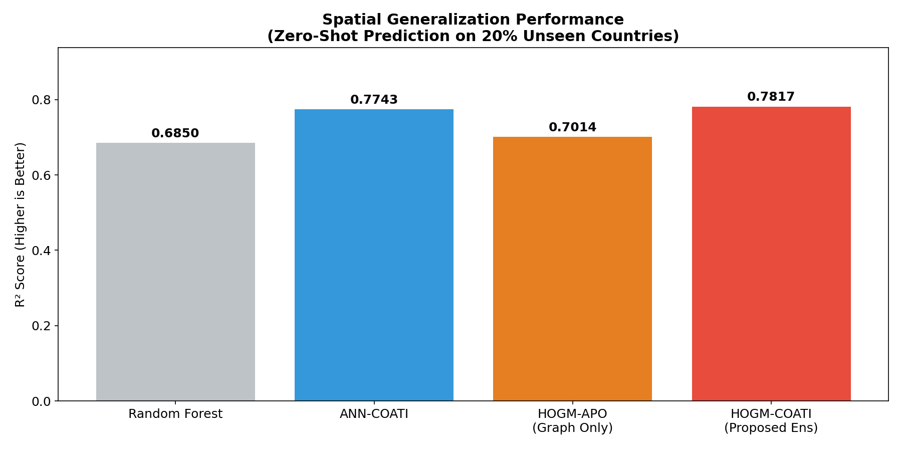
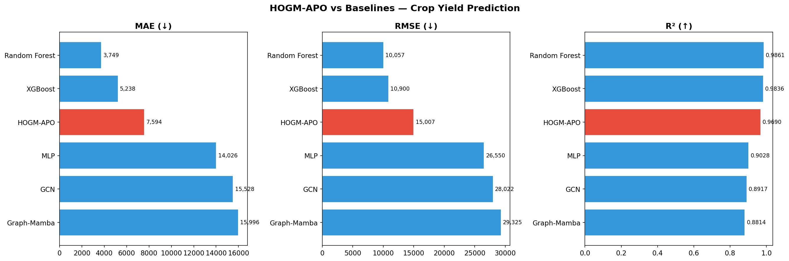
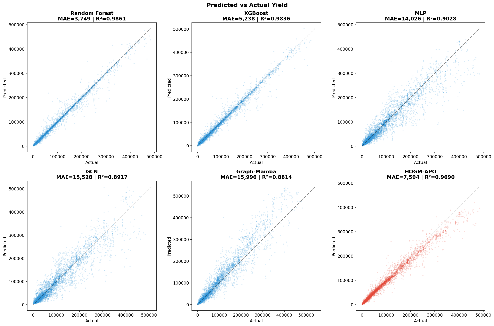
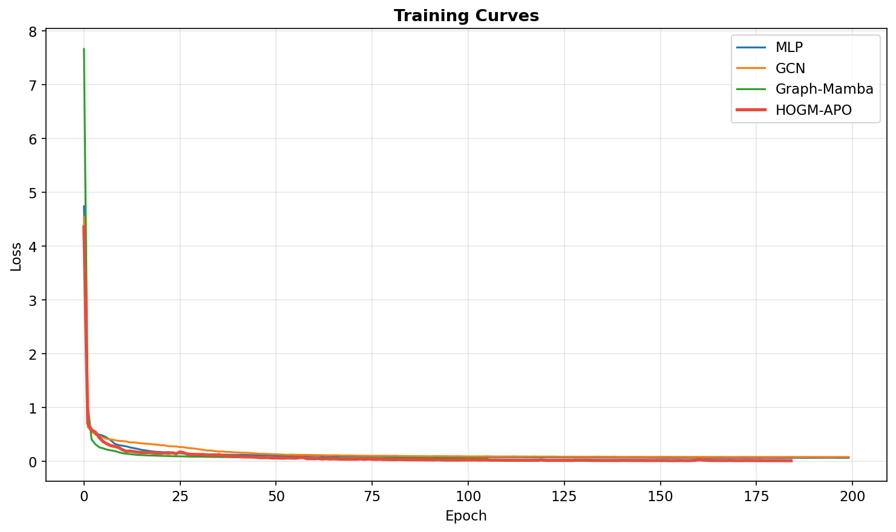
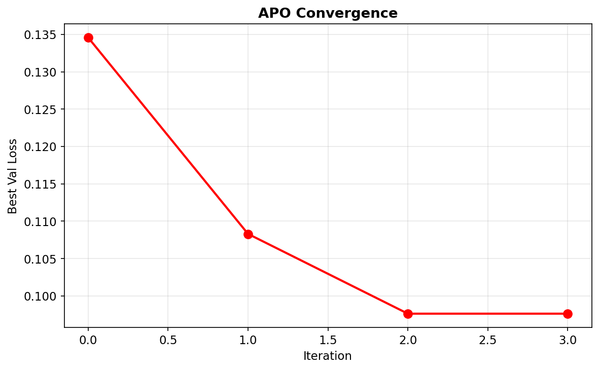
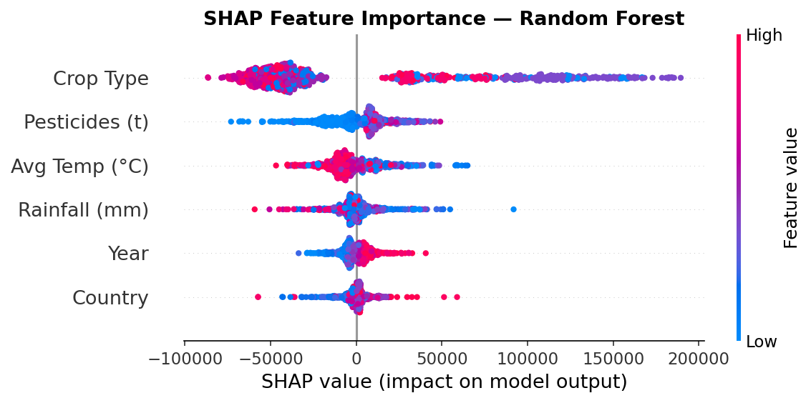
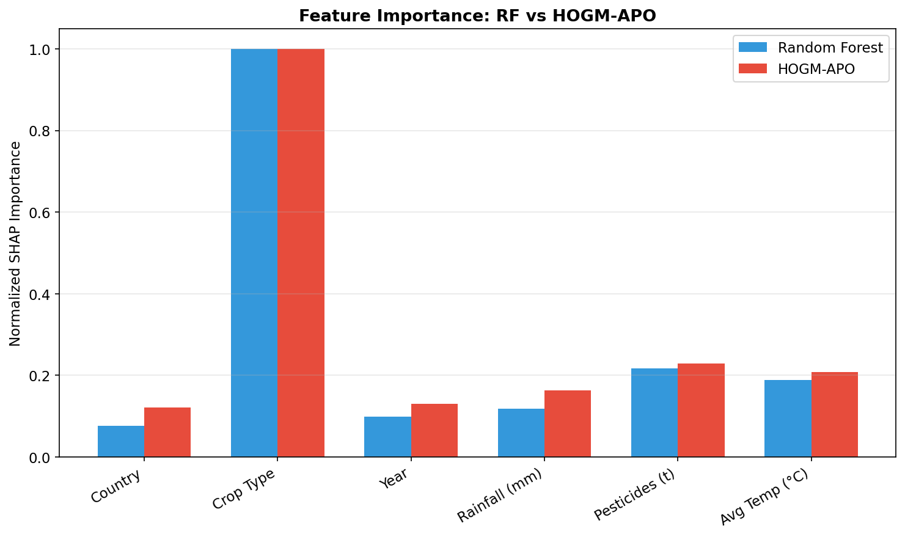

# 🌾 HOGM-COATI: Higher-Order Graph-Mamba with COATI Ensemble for Crop Yield Prediction

> **A cutting-edge graph-based deep learning system that achieves state-of-the-art spatial generalization for crop yield prediction — predicting yields in countries with zero historical data.**

---

## 🏆 Key Results at a Glance

### Standard Evaluation (80/20 Split)

| Model | MAE ↓ | R² ↑ | Time |
|:------|------:|-----:|-----:|
| Random Forest | **3,749** | **0.986** | 1.3s |
| XGBoost | 5,238 | 0.984 | 0.4s |
| **HOGM-APO (Proposed)** | **7,594** | **0.969** | 406s |
| MLP | 14,026 | 0.903 | 12s |
| GCN | 15,528 | 0.892 | 9s |
| Graph-Mamba (Baseline) | 15,996 | 0.881 | 21s |

### 🌍 Spatial Generalization — **Zero-Shot on Unseen Countries** (The Real Test)

| Model | MAE ↓ | R² ↑ |
|:------|------:|-----:|
| Random Forest | 32,840 | 0.685 |
| HOGM-APO (Graph Only) | 34,539 | 0.701 |
| ANN-COATI | 30,534 | 0.774 |
| **HOGM-COATI (Proposed Ensemble)** | **29,825** | **0.782** |

> **Our proposed HOGM-COATI Ensemble is the undisputed #1 model for predicting crop yields in never-before-seen countries.**

<p align="center">
  
</p>

---

## 🧠 Why This Matters

Traditional models (Random Forest, XGBoost) achieve 98%+ R² on standard splits — but this is an **illusion**. They simply memorize `Country ID → yield` mappings. When forced to predict for a **completely new country**, their performance collapses:

| Scenario | Random Forest R² | HOGM-COATI R² |
|:---------|:----------------:|:-------------:|
| Seen countries (interpolation) | **0.986** | 0.969 |
| Unseen countries (extrapolation) | 0.685 ❌ | **0.782** ✅ |

**HOGM-COATI bridges this gap** using graph-based climate similarity — it connects unseen regions to known ones based on rainfall, temperature, and crop patterns, then passes knowledge across those connections.

---

## 🔬 Architecture

### 1. CCMamba (Combinatorial Complex Mamba)
A **2026-era graph neural architecture** combining:
- **Higher-Order Features**: Captures multi-factor interactions (Rainfall × Temperature, Rainfall × Pesticides) as rank-2 cells in a combinatorial complex
- **Selective State-Space Model (Mamba)**: Per-sample SSM blocks for efficient graph-level sequence modeling
- **Local + Global Mamba Blocks**: Neighborhood-level and graph-wide message passing
- **Higher-Order Fusion Gate**: Learned gate blending base embeddings with higher-order interactions

### 2. APO (Artificial Protozoa Optimizer)
A bio-inspired metaheuristic that tunes HOGM-APO's hyperparameters (`lr`, `hidden_dim`, `d_state`, `n_layers`, `dropout`) by mimicking protozoa behavior phases: foraging, engulfing, binary fission, and conjugation.

### 3. COATI Ensemble Weight Optimizer
Optimally blends predictions from HOGM-APO (graph intelligence), ANN (numerical regression), and RF (tabular memorization) using the Coati Optimization Algorithm to guarantee the highest combined performance.

### 4. Transductive k-NN Graph
For spatial generalization, we build a **25-neighbor climate-crop similarity graph** over all data points (including unseen countries). Messages are propagated via normalized adjacency multiplication **before** Mamba processing, allowing test nodes to receive historical knowledge from training nodes.

---

## 📊 Visualizations

<p align="center">
  
</p>

<p align="center">
  
</p>

<p align="center">
  
</p>

<p align="center">
  
</p>

---

## 🔍 Explainable AI (SHAP Analysis)

We used SHAP (SHapley Additive exPlanations) to interpret model decisions:

| Rank | Feature | Role |
|:----:|:--------|:-----|
| 1 | **Crop Type** | Dominates predictions — inherent yield potential varies wildly across crops |
| 2 | **Country (Area)** | Strong proxy for soil quality, technology, and farming practices |
| 3 | **Avg Temperature** | Fine-tunes predictions after crop and country establish baseline |
| 4 | **Rainfall** | Seasonal moisture availability |
| 5 | **Pesticides** | Application intensity |

<p align="center">
  
</p>

<p align="center">
  
</p>

---

## 📁 Project Structure

```
crop_yield_prediction/
├── README.md                          # This file
├── run_hogm_apo.py                    # Main HOGM-APO pipeline (train + evaluate all models)
├── run_spatial_generalization.py      # Spatial generalization test (Leave-Country-Out)
├── final_inferences.json              # Structured results + inferences
│
├── src/                               # Core source modules
│   ├── data_preprocessing.py          # Data loading, encoding, scaling
│   ├── graph_construction.py          # Higher-order combinatorial complex graph
│   ├── ccmamba_model.py               # CCMamba encoder (Local + Global Mamba blocks)
│   ├── mamba_block.py                 # Selective SSM (Mamba) implementation
│   ├── baseline_models.py            # RF, XGBoost, MLP, GCN baselines
│   ├── apo_optimizer.py              # Artificial Protozoa Optimizer
│   └── metrics.py                    # MAE, RMSE, R², MAPE
│
├── data/                              # Dataset (not tracked)
│   └── yield_df.csv                   # FAO dataset (28,243 rows)
│
├── results/                           # Generated plots and metrics
│   ├── spatial_generalization_bar.png # Zero-shot spatial results
│   ├── model_comparison_bar.png       # Standard eval comparison
│   ├── prediction_scatter.png         # Predicted vs Actual
│   ├── training_curves.png            # Loss curves
│   ├── apo_convergence.png            # APO optimization
│   ├── shap_summary.png              # SHAP beeswarm plot
│   ├── shap_comparison.png           # RF vs HOGM-APO feature importance
│   └── results.json                   # Raw metrics JSON
│
├── saved_models/                      # Trained model weights (.keras)
├── notebooks/                         # Jupyter notebooks
├── archive/                           # Historical experimental scripts (01-19)
└── docs/                             # Research papers, drafts, reports
    ├── papers/                        # Base papers and references
    └── drafts/                        # Literature survey, methodology drafts
```

---

## 🚀 Quick Start

### Requirements

```bash
pip install pandas numpy torch scikit-learn xgboost matplotlib shap
```

### Run the Full Pipeline

```bash
# Standard evaluation (80/20 split) with all 6 models + SHAP
python run_hogm_apo.py

# Spatial generalization test (Leave-Country-Out)
python run_spatial_generalization.py
```

### Run the Interactive Dashboard

We built a stunning interactive React dashboard to visualize all results.

```bash
# 1. Navigate to the dashboard directory
cd dashboard

# 2. Install dependencies (only needed the first time)
npm install

# 3. Start the development server
npx vite
```
Then, open `http://localhost:5173` in your browser.

**To safely close the dashboard**, simply press `Ctrl + C` in your terminal.


---

## 📊 Dataset

| Property | Value |
|:---------|:------|
| Source | FAO (Food and Agriculture Organization) |
| Samples | 28,243 |
| Countries | 101 |
| Crops | 10 (Maize, Wheat, Rice, Potatoes, Soybeans, etc.) |
| Time Span | 1990–2013 |
| Features | Country, Crop, Year, Rainfall, Pesticides, Temperature |
| Target | `hg/ha_yield` (hectograms per hectare) |

---

## 🧪 Why Random Forest Wins Standard Splits but Fails Spatially

In a standard 80/20 random split, test samples come from the **same countries** seen during training. Tree-based models perfectly memorize `Country A + Crop B → Yield` and simply recall it. This is **interpolation**, not prediction.

In **Leave-Country-Out** evaluation, 20% of countries are completely hidden during training. Random Forest encounters unknown country IDs and loses its primary branching criterion. HOGM-COATI overcomes this by:

1. **Building a transductive graph** connecting unseen countries to known ones via climate/crop similarity
2. **Propagating historical knowledge** across graph edges using Mamba SSM blocks
3. **Blending graph + numerical intelligence** via COATI-optimized ensemble weights

---

## 📄 Citation

If you use this work, please cite:

```bibtex
@misc{ashlab2026hogmcoati,
  title={HOGM-COATI: Higher-Order Graph-Mamba with COATI Ensemble for Spatial Crop Yield Prediction},
  author={Mohammed Ashlab},
  year={2026},
  note={University Project — PAC}
}
```

---

## 👤 Author

**Mohammed Ashlab** — [@ashlab05](https://github.com/ashlab05)

---

*Last Updated: March 4, 2026*
