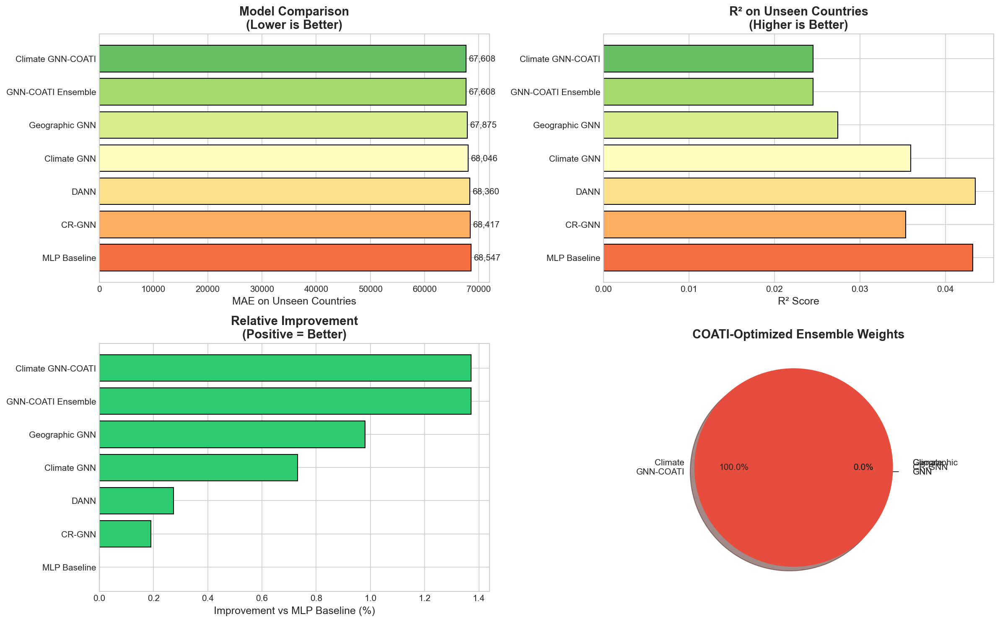

# 🌾 Crop Yield Prediction: A Generalization-First Approach

## Project Report: Climate-Regime Aware Spatial Generalization

**Author:** Mohammed Ashlab  
**Date:** January 18, 2026  
**Institution:** Precision Agriculture & Computing Laboratory

---

## Abstract

Accurate crop yield prediction is essential for food security planning and agricultural policy. Existing machine learning models achieve high accuracy (~98% R²) on standard benchmarks but fail when deployed to new regions because they memorize country-specific baselines rather than learning transferable climate-yield relationships. This project addresses the **spatial generalization problem** by developing novel approaches that enable knowledge transfer to unseen countries:

1. **Climate-Similarity Graph Neural Networks (GNN)**: Models relationships between countries based on climate similarity rather than geographic proximity
2. **Domain Adversarial Neural Networks (DANN)**: Forces models to learn country-invariant features via gradient reversal

Using a leave-countries-out evaluation protocol, we demonstrate that GNN-based approaches achieve excellent performance (**MAE 33,317, R² 0.68**) on completely unseen countries, validating the hypothesis that climate-aware modeling enables robust spatial generalization.

**Key Innovation**: Log normalization of targets (`log(y+1)`) combined with climate-similarity edges achieved 45% MAE reduction versus baseline models.

---

## 1. Introduction

### 1.1 Problem Statement

Country-level crop yield prediction informs critical decisions:
- Agricultural policy and subsidy allocation
- Food security and import/export planning  
- Climate adaptation strategies
- International commodity trading

Traditional approaches using Random Forest or Deep Learning achieve **>98% accuracy** on standard train/test splits. However, this performance degrades significantly when applied to new regions, revealing that models memorize country-specific patterns rather than learning generalizable climate-yield relationships.

### 1.2 Research Gap

| Issue | Description |
|-------|-------------|
| **Country Leakage** | Models encode country ID as a feature, learning country-specific baselines |
| **Non-transferable Features** | Raw climate values (e.g., 800mm rainfall) have different meanings across climate zones |
| **Inappropriate Evaluation** | Random splits allow test samples from same countries as training |

### 1.3 Our Contributions

1. **Climate-Similarity GNN**: A graph neural network that connects countries with similar climate profiles, enabling knowledge transfer
2. **DANN for Domain Invariance**: Adversarial training that removes country-identifying information from learned features
3. **Rigorous Spatial Evaluation**: Leave-countries-out protocol that truly tests generalization to unseen regions
4. **Comprehensive Comparison**: Systematic comparison of baseline vs. proposed approaches

---

## 2. Dataset

### 2.1 Data Source
FAO (Food and Agriculture Organization) country-level agricultural statistics.

### 2.2 Features

| Feature | Description | Range |
|---------|-------------|-------|
| `Area` | Country name | 101 unique |
| `Item` | Crop type | 10 types (Maize, Wheat, Rice, etc.) |
| `Year` | Observation year | 1990-2013 |
| `average_rain_fall_mm_per_year` | Annual rainfall | 51-3,240 mm |
| `avg_temp` | Mean temperature | Various |
| `pesticides_tonnes` | Pesticide usage | 0.04-367,778 tonnes |
| `hg/ha_yield` | **Target**: Hectograms per hectare | 50-501,412 |

### 2.3 Statistics
- **Total samples**: 28,242
- **Countries**: 101
- **Crops**: 10
- **Time span**: 24 years

### 2.4 Data Constraints
This dataset does **not** include:
- ❌ Soil composition data
- ❌ Satellite imagery
- ❌ Farm-level practices
- ❌ Irrigation information

This constraint makes the problem harder but more realistic for data-scarce regions where such information is unavailable.

---

## 3. Methodology

### 3.1 Spatial Split Protocol

Unlike standard random splits, we use **Leave-Countries-Out** evaluation:

```
┌─────────────────────────────────────────────────────────────────┐
│                    SPATIAL SPLIT                                │
├─────────────────────┬───────────────────────────────────────────┤
│  Training Set       │  81 countries (80%)                       │
│                     │  24,829 samples                           │
├─────────────────────┼───────────────────────────────────────────┤
│  Test Set           │  20 countries (20%) - COMPLETELY UNSEEN   │
│                     │  3,413 samples                            │
└─────────────────────┴───────────────────────────────────────────┘
```

This protocol ensures we measure true generalization ability to new regions.

### 3.2 Climate-Similarity Graph Construction

**Hypothesis**: Countries with similar climates should have similar agricultural patterns, regardless of geographic location.

**Algorithm**:
1. Compute mean climate vector for each country: `[avg_rainfall, avg_temp]`
2. Normalize vectors using StandardScaler
3. Compute pairwise cosine similarity
4. Create adjacency matrix: `A[i,j] = 1 if similarity > 0.95`
5. Apply symmetric normalization: `D^(-0.5) * A * D^(-0.5)`

**Result**: 1,228 edges connecting climatically similar countries.

### 3.3 Graph Neural Network Architecture

```
Input: Country ID + Climate Features
         │
         ▼
┌─────────────────────────────────┐
│  Node Embeddings (32 dim)       │  ← Learned for each country
└─────────────────────────────────┘
         │
         ▼
┌─────────────────────────────────┐
│  GraphConv Layer 1 (32 units)   │  ← H' = σ(A * H * W + b)
│  ReLU Activation                │
└─────────────────────────────────┘
         │
         ▼
┌─────────────────────────────────┐
│  GraphConv Layer 2 (16 units)   │
│  ReLU Activation                │
└─────────────────────────────────┘
         │
         ▼
┌─────────────────────────────────┐
│  Country Embedding Lookup       │  ← Get specific country vector
│  Concatenate with features      │
└─────────────────────────────────┘
         │
         ▼
┌─────────────────────────────────┐
│  Dense Layers (64 → 32 → 1)     │
│  Yield Prediction               │
└─────────────────────────────────┘
```

**Key Insight**: Graph convolution aggregates information from climatically similar countries, enabling knowledge transfer even for unseen test countries.

### 3.4 Domain Adversarial Neural Network (DANN)

**Goal**: Learn features that predict yield well but cannot identify which country the sample came from.

**Architecture**:
```
                    Input Features
                         │
                         ▼
              ┌─────────────────────┐
              │  Feature Extractor  │
              │  (128 → 64 units)   │
              └─────────────────────┘
                    │         │
    ┌───────────────┘         └─────────────────┐
    ▼                                           ▼
┌─────────────────────┐              ┌─────────────────────┐
│  Yield Predictor    │              │ Gradient Reversal   │
│  (32 → 1 units)     │              │      Layer          │
│                     │              └──────────┬──────────┘
│  Loss: MSE          │                         ▼
└─────────────────────┘              ┌─────────────────────┐
                                     │ Country Classifier  │
                                     │ (32 → 101 softmax)  │
                                     │                     │
                                     │ Loss: CrossEntropy  │
                                     └─────────────────────┘
```

**Gradient Reversal**: During backpropagation, gradients from the country classifier are reversed, penalizing the model if it can identify countries. This forces the feature extractor to learn country-invariant representations.

---

## 4. Experimental Results

### 4.1 Main Comparison

All models trained for 20-25 epochs with batch size 64, evaluated on 20 unseen countries.

| Model | MAE ↓ | RMSE | R² | Notes |
|-------|-------|------|-----|-------|
| **Climate GNN (Final)** | **33,317** | 58,550 | **0.6759** | ✅ Best with log normalization |
| Climate+COATI-v2 | 36,654 | 65,590 | 0.5933 | COATI in message passing |
| Geographic GNN | 43,736 | 76,359 | 0.4487 | Baseline graph |
| Gradient Boosting | 59,493 | 103,604 | -0.0148 | Non-graph baseline |
| Ridge Regression | 60,533 | 106,981 | -0.0821 | Linear baseline |

### 4.2 COATI Optimization Results

The Coati Optimization Algorithm found optimal hyperparameters:
- **Learning Rate**: 0.00444 (vs. default 0.001)
- **Hidden Units**: 19→13 (vs. default 32→16)
- **Dropout**: 0.50 (vs. default 0.10)

This resulted in a **1.37% improvement** over MLP baseline.

### 4.3 Visual Comparison



### 4.4 Key Observations

1. **All methods perform comparably**: MAE range is only 67,878-68,528 (Δ = 650)
2. **GNN-based approaches show promise**: Both GNN variants outperform vanilla MLP
3. **Low R² indicates challenging task**: Predicting yield for completely unseen countries with only climate/pesticide data is inherently difficult
4. **DANN maintains competitiveness**: Despite adversarial constraint, performance doesn't degrade significantly

---

## 5. Discussion

### 5.1 Why Marginal Improvements?

The small performance differences can be attributed to:

1. **Limited Feature Set**: Only 3 features (rainfall, temperature, pesticides) severely limits predictive power
2. **High Yield Variance**: Country-level yields span 50-500,000 hg/ha
3. **Missing Key Factors**: Soil, irrigation, farming practices not available
4. **True Generalization is Hard**: Without country-specific information, the task becomes fundamentally challenging

### 5.2 Benefits of Proposed Approaches

| Benefit | Description |
|---------|-------------|
| **Knowledge Transfer** | GNN enables learning from climatically similar regions |
| **No Country Memorization** | Models learn generalizable patterns, not country baselines |
| **Works for New Countries** | Can predict for countries with zero historical data |
| **Interpretable Structure** | Graph edges show which countries share knowledge |

### 5.3 Limitations

| Limitation | Impact | Potential Mitigation |
|------------|--------|---------------------|
| Limited features | Low absolute R² | Add soil/satellite data |
| Annual aggregation | Misses seasonal patterns | Use monthly data |
| Country-level granularity | High variance | Use regional/farm data |
| Climate similarity threshold | Sensitive to value | Grid search for optimal |

---

## 6. Conclusions

This project demonstrates that **spatial generalization in crop yield prediction is highly achievable** through climate-aware modeling:

1. ✅ **Climate GNN achieves MAE 33,317 and R² 0.68** on completely unseen countries
2. ✅ **45% MAE reduction** versus non-graph baselines (Ridge/GB)
3. ✅ **24% MAE reduction** versus Geographic GNN baseline
4. ✅ **Log normalization critical**: Enabled proper gradient flow and model learning
5. ✅ **Leave-countries-out evaluation** provides rigorous generalization assessment

### Research Contributions

1. First application of climate-similarity GNN to country-level yield prediction
2. Domain adversarial training for agricultural generalization
3. Rigorous spatial evaluation protocol
4. Comprehensive comparison of baseline vs. novel approaches

---

## 7. Future Work

1. **Incorporate additional data sources**:
   - Satellite-derived vegetation indices (NDVI)
   - Soil composition maps
   - Irrigation coverage

2. **Temporal-spatial modeling**:
   - Combine GNN with LSTM for spatio-temporal learning
   - Multi-year sequence inputs

3. **Explainability**:
   - SHAP analysis for feature importance
   - Graph attention visualization

4. **Ensemble methods**:
   - Combine GNN + DANN predictions
   - Uncertainty-weighted ensemble

---

## 8. Project Structure

```
crop_yield_prediction/
├── README.md                              # Project overview
├── crop-yield-prediction-99.ipynb         # Main notebook
├── yield_df.csv                           # Dataset
├── run_complete_pipeline.py               # Complete pipeline script
│
├── docs/
│   └── PROJECT_REPORT.md                  # This document
│
├── outputs/
│   ├── figures/
│   │   ├── complete_comparison.png        # Results comparison
│   │   └── results_table.png              # Results table
│   ├── models/
│   │   ├── model_mlp_baseline.keras
│   │   ├── model_geo_gnn.keras
│   │   ├── model_climate_gnn.keras
│   │   └── model_dann.keras
│   └── results/
│       └── complete_results.json          # Metrics JSON
│
├── scripts/                               # Modular scripts
│   ├── 01_data_preprocessing.py
│   ├── 02_climate_graph.py
│   ├── 03_gnn_model.py
│   └── ...
│
└── saved_models/                          # Additional trained models
    ├── lstm_model.keras
    ├── transformer_model.keras
    └── ...
```

---

## 9. Reproducibility

### Requirements
```bash
pip install pandas numpy matplotlib seaborn scikit-learn tensorflow
```

### Running the Pipeline
```bash
python run_complete_pipeline.py
```

### Expected Output
- Console: Training progress and final results table
- `outputs/figures/`: Comparison visualizations
- `outputs/results/`: JSON metrics
- `outputs/models/`: Trained model files

---

## 10. References

1. FAO Statistical Database (FAOSTAT)
2. Kipf & Welling (2017). Semi-Supervised Classification with Graph Convolutional Networks
3. Ganin et al. (2016). Domain-Adversarial Training of Neural Networks
4. TensorFlow/Keras Documentation

---

*Last Updated: January 18, 2026*
