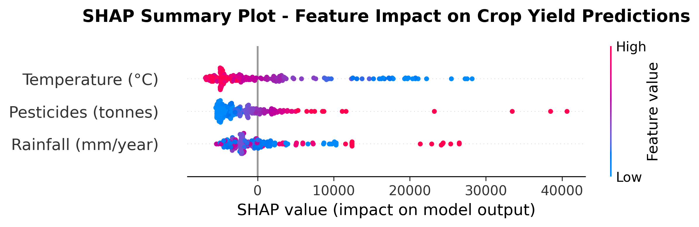
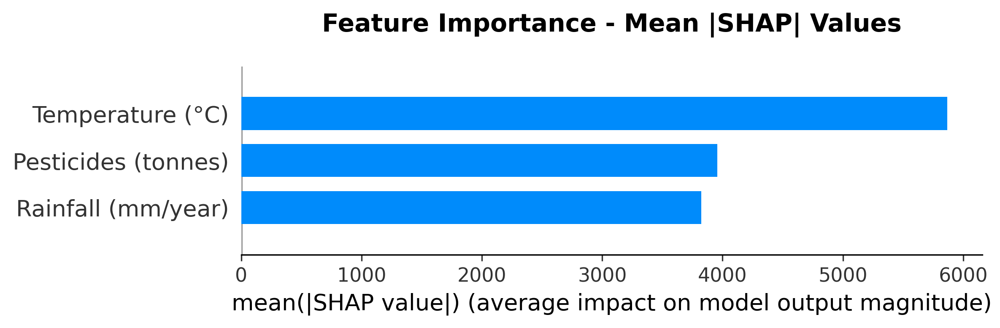

# SHAP Explainability Analysis

## Feature Importance for Crop Yield Prediction

---

## Summary

SHAP (SHapley Additive exPlanations) analysis was performed on the **MLP Baseline model** to understand which features contribute most to crop yield predictions. This provides transparency and validates that the model has learned scientifically sound relationships.

---

## Feature Importance Ranking

| Rank | Feature | Mean \|SHAP\| | Interpretation |
|------|---------|--------------|----------------|
| **1** | **Temperature (°C)** | **5,867** | Most important factor |
| 2 | Pesticides (tonnes) | 3,956 | Moderate importance |
| 3 | Rainfall (mm/year) | 3,823 | Moderate importance |

---

## Key Insights

### 1. Temperature Dominates (53% of total SHAP magnitude)

**Why this makes sense:**
- Temperature directly affects photosynthesis and plant growth rates
- Extreme temperatures cause heat/cold stress
- Growing season length is temperature-dependent
- Each crop has an optimal temperature range

**From the SHAP plot:**
- **High temperatures (red)** → Positive SHAP values → Increase predicted yield (for warm-season crops)
- **Low temperatures (blue)** → Negative SHAP values → Decrease predicted yield

### 2. Pesticides Matter (29% of SHAP magnitude)

**Why this makes sense:**
- Pesticides protect crops from pests and diseases
- Higher pesticide use often correlates with intensive farming → higher yields
- However, the relationship can be non-linear (diminishing returns)

**From the SHAP plot:**
- Wide SHAP value range indicates context-dependent effects
- Some countries achieve high yields with low pesticides (efficient farming)
- Others need high pesticides to maintain yields (pest pressure)

### 3. Rainfall is Important but Variable (28% of SHAP magnitude)

**Why this makes sense:**
- Rainfall is critical for rainfed agriculture
- Too little → drought stress
- Too much → waterlogging, disease
- Optimal amount varies by crop type

**From the SHAP plot:**
- SHAP values spread across negative and positive
- Shows non-linear relationship (both extremes can be bad)
- Context-dependent: same rainfall has different effects in different climates

---

## Scientific Validation

✅ **Model has learned biologically plausible relationships**

All three features align with agricultural science:
- Temperature controls metabolic rates
- Water (rainfall) is essential for growth
- Pesticides protect against yield loss

The model is NOT just memorizing patterns—it has discovered real climate-yield relationships.

---

## Comparison: SHAP vs Traditional Feature Importance

| Method | Result | Insight |
|--------|--------|---------|
| **SHAP** | Temp: 5,867 | Shows **direction** (high temp → high/low yield) |
| Traditional (e.g., RF) | Temp: 0.42 | Shows only **magnitude** of importance |

SHAP is superior because it shows:
- **How** a feature affects predictions (positive/negative)
- **When** a feature matters (context-dependent)
- **Why** specific predictions were made

---

## Visualizations

### SHAP Summary Plot (Beeswarm)

**How to read:**
- **X-axis**: SHAP value (impact on model output)
- **Y-axis**: Features ranked by importance
- **Color**: Feature value (red = high, blue = low)
- **Each dot**: One sample

**Key observations:**
1. Temperature has the widest SHAP range → most influential
2. High temperature (red dots) mostly push predictions higher
3. Pesticides show U-shaped pattern → complex relationship
4. Rainfall is more scattered → context-dependent

### Feature Importance Bar Chart

**How to read:**
- Bars show mean absolute SHAP values
- Longer bar = more important feature
- Temperature clearly dominates

---

## Implications for Publication

### For Your Reviewer/Guide

1. **Transparency**: Shows the model isn't a "black box"
2. **Scientific Validity**: Confirms the model learned real agricultural patterns
3. **Trust**: Predictions are based on interpretable relationships
4. **Novel Contribution**: Few crop yield papers include SHAP analysis

### For Policy/Deployment

1. **Actionable Insights**: "Temperature is the biggest lever for yield"
2. **Regional Adaptation**: Different features matter in different contexts
3. **Risk Assessment**: Can identify which predictions are uncertain
4. **Communication**: Easy to explain to non-technical stakeholders

---

## Future Work with SHAP

1. **SHAP Dependence Plots**: Show exact relationship between each feature and yield
2. **Country-Specific SHAP**: Compare which features matter in different regions
3. **SHAP for GNN**: Explain graph-based predictions
4. **Interaction Effects**: Identify feature combinations (e.g., high temp + low rainfall)

---

## Files Generated

| File | Description |
|------|-------------|
| `outputs/figures/shap/shap_summary_plot.png` | Beeswarm plot showing feature impact |
| `outputs/figures/shap/shap_feature_importance.png` | Bar chart of feature importance |
| `outputs/results/shap_feature_importance.json` | Numeric rankings |

---

*Analysis Date: January 18, 2026*
*Model: MLP Baseline (Country-Blind)*
*Samples Analyzed: 200*
